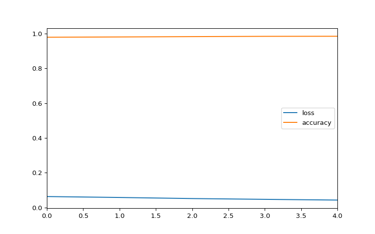
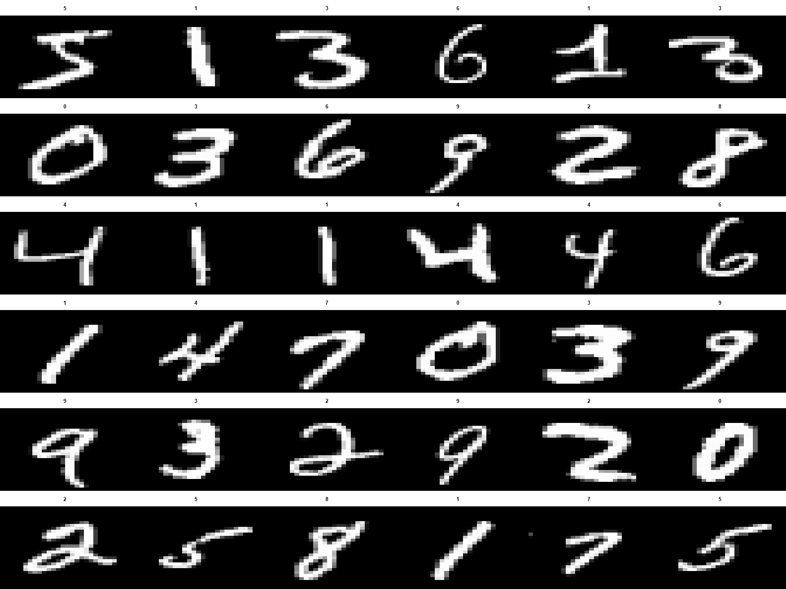
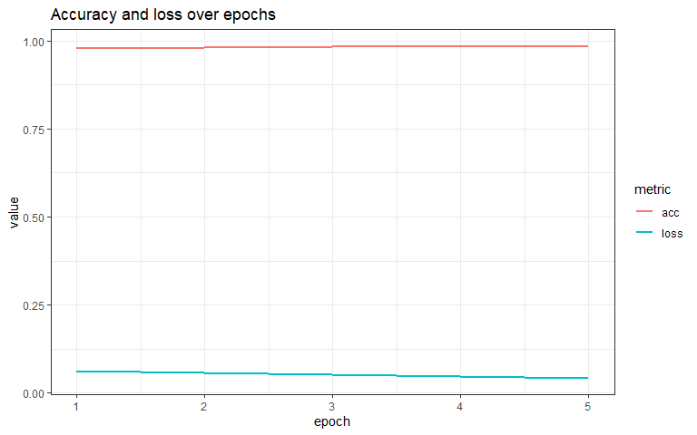

# Intro
In this demo I will show you how to run Python from RStudio, using the `{reticulate}` Python interface for R. The Python code that we are going to run was derived [from the beginners tutorial at the TensorFlow homepage](https://www.tensorflow.org/tutorials/quickstart/beginner). To get all files related to this tutorial, visit [this repo on Github:](https://github.com/uashogeschoolutrecht/python_from_rstudio). The Python commands below can be found in the script: './py/tf_intro.py' in Github repo.

This short introduction to deep learning uses Keras to:

    - Build a neural network (model) that classifies images.
    - Train this neural network.
    - And, finally, evaluate the accuracy of the model.

This document was build from RStudio using an RMarkdown literate programming script and was published to RStudio::CONNECT to host the html rendered version, you see here. The template used is ["rmdformats::downcute"](https://github.com/juba/rmdformats). Click this link for more details and more examples of other templates. The rendered version of this script is hosted [here](https://datascience.hu.nl/rsconnect/deep-learning-with-python-from-r/)

Download and install TensorFlow 2. Import TensorFlow into your Python environment. To keep things simple, I decided to install it in the base environment for now. I recommend to work with local virtual environments though.

Run the following one-time in the Terminal:


```bash
pip install tensorflow
pip install tensorflow_hub
pip install numpy
pip install pandas
```

# Packages and libraries
This loads the required R and Python packages to be able to run Python code in RStudio and to further process the model output in R. 

```r
library(tidyverse)
```

```
## -- Attaching packages --------------------------------------- tidyverse 1.3.1 --
```

```
## v ggplot2 3.3.3     v purrr   0.3.4
## v tibble  3.1.1     v dplyr   1.0.5
## v tidyr   1.1.3     v stringr 1.4.0
## v readr   1.4.0     v forcats 0.5.1
```

```
## -- Conflicts ------------------------------------------ tidyverse_conflicts() --
## x dplyr::filter() masks stats::filter()
## x dplyr::lag()    masks stats::lag()
```

```r
library(reticulate)
```

Import python libraries in your R session

```r
reticulate::import("tensorflow")
```

```
## Module(tensorflow)
```


```python
import tensorflow as tf
```

# Load the data
Load and prepare the MNIST dataset. Convert the samples from integers to floating-point numbers:

```python
mnist = tf.keras.datasets.mnist

(x_train, y_train), (x_test, y_test) = mnist.load_data()
x_train, x_test = x_train / 255.0, x_test / 255.0
```

# Define model and Neural network
Build the tf.keras.Sequential model by stacking layers. Choose an optimizer and loss function for training:

```python
model = tf.keras.models.Sequential([
  tf.keras.layers.Flatten(input_shape=(28, 28)),
  tf.keras.layers.Dense(128, activation='relu'),
  tf.keras.layers.Dropout(0.2),
  tf.keras.layers.Dense(10)
])
```

# Get model metrics
For each example the model returns a vector of "logits" or "log-odds" scores, one for each class.

```python
predictions = model(x_train[:1]).numpy()
predictions
```

```
## array([[ 0.11430894,  0.21653232,  0.09422498,  0.14909045, -0.4942153 ,
##         -0.5228589 , -0.21773918,  0.14840491, -0.83053476, -0.53230315]],
##       dtype=float32)
```

The tf.nn.softmax function converts these logits to "probabilities" for each class:

```python
tf.nn.softmax(predictions).numpy()
```

```
## array([[0.12721391, 0.14090605, 0.12468444, 0.13171645, 0.06922387,
##         0.06726918, 0.09126996, 0.13162619, 0.04945318, 0.06663686]],
##       dtype=float32)
```

```python
loss_fn = tf.keras.losses.SparseCategoricalCrossentropy(from_logits=True)

loss_fn(y_train[:1], predictions).numpy()
```

```
## 2.6990533
```

This loss is equal to the negative log probability of the true class: It is zero if the model is sure of the correct class.

This untrained model gives probabilities close to random (1/10 for each class), so the initial loss should be close to -tf.math.log(1/10) ~= 2.3.

# Model fit
The Model.fit method adjusts the model parameters to minimize the loss:     

```python
model.compile(optimizer='adam',
              loss=loss_fn,
              metrics=['accuracy'])

model.fit(x_train, y_train, epochs=5)
```

```
## Epoch 1/5
## 
##    1/1875 [..............................] - ETA: 14:37 - loss: 2.4702 - accuracy: 0.1250
##   34/1875 [..............................] - ETA: 2s - loss: 1.5745 - accuracy: 0.5386   
##   64/1875 [>.............................] - ETA: 2s - loss: 1.2145 - accuracy: 0.6533
##   95/1875 [>.............................] - ETA: 2s - loss: 1.0163 - accuracy: 0.7135
##  124/1875 [>.............................] - ETA: 2s - loss: 0.8846 - accuracy: 0.7530
##  153/1875 [=>............................] - ETA: 2s - loss: 0.8161 - accuracy: 0.7702
##  182/1875 [=>............................] - ETA: 2s - loss: 0.7536 - accuracy: 0.7871
##  208/1875 [==>...........................] - ETA: 2s - loss: 0.7207 - accuracy: 0.7967
##  236/1875 [==>...........................] - ETA: 2s - loss: 0.6815 - accuracy: 0.8076
##  265/1875 [===>..........................] - ETA: 2s - loss: 0.6493 - accuracy: 0.8164
##  296/1875 [===>..........................] - ETA: 2s - loss: 0.6155 - accuracy: 0.8252
##  325/1875 [====>.........................] - ETA: 2s - loss: 0.5919 - accuracy: 0.8311
##  354/1875 [====>.........................] - ETA: 2s - loss: 0.5717 - accuracy: 0.8360
##  386/1875 [=====>........................] - ETA: 2s - loss: 0.5544 - accuracy: 0.8400
##  419/1875 [=====>........................] - ETA: 2s - loss: 0.5364 - accuracy: 0.8452
##  451/1875 [======>.......................] - ETA: 2s - loss: 0.5224 - accuracy: 0.8494
##  482/1875 [======>.......................] - ETA: 2s - loss: 0.5081 - accuracy: 0.8537
##  515/1875 [=======>......................] - ETA: 2s - loss: 0.4934 - accuracy: 0.8577
##  546/1875 [=======>......................] - ETA: 2s - loss: 0.4821 - accuracy: 0.8603
##  578/1875 [========>.....................] - ETA: 2s - loss: 0.4711 - accuracy: 0.8634
##  609/1875 [========>.....................] - ETA: 2s - loss: 0.4605 - accuracy: 0.8665
##  639/1875 [=========>....................] - ETA: 2s - loss: 0.4514 - accuracy: 0.8693
##  674/1875 [=========>....................] - ETA: 1s - loss: 0.4411 - accuracy: 0.8725
##  702/1875 [==========>...................] - ETA: 1s - loss: 0.4331 - accuracy: 0.8750
##  734/1875 [==========>...................] - ETA: 1s - loss: 0.4253 - accuracy: 0.8771
##  768/1875 [===========>..................] - ETA: 1s - loss: 0.4177 - accuracy: 0.8792
##  799/1875 [===========>..................] - ETA: 1s - loss: 0.4108 - accuracy: 0.8814
##  830/1875 [============>.................] - ETA: 1s - loss: 0.4041 - accuracy: 0.8831
##  864/1875 [============>.................] - ETA: 1s - loss: 0.3978 - accuracy: 0.8850
##  892/1875 [=============>................] - ETA: 1s - loss: 0.3926 - accuracy: 0.8866
##  926/1875 [=============>................] - ETA: 1s - loss: 0.3871 - accuracy: 0.8880
##  963/1875 [==============>...............] - ETA: 1s - loss: 0.3804 - accuracy: 0.8898
## 1003/1875 [===============>..............] - ETA: 1s - loss: 0.3749 - accuracy: 0.8916
## 1038/1875 [===============>..............] - ETA: 1s - loss: 0.3708 - accuracy: 0.8929
## 1072/1875 [================>.............] - ETA: 1s - loss: 0.3668 - accuracy: 0.8941
## 1105/1875 [================>.............] - ETA: 1s - loss: 0.3629 - accuracy: 0.8951
## 1137/1875 [=================>............] - ETA: 1s - loss: 0.3587 - accuracy: 0.8963
## 1171/1875 [=================>............] - ETA: 1s - loss: 0.3550 - accuracy: 0.8974
## 1206/1875 [==================>...........] - ETA: 1s - loss: 0.3511 - accuracy: 0.8985
## 1238/1875 [==================>...........] - ETA: 1s - loss: 0.3470 - accuracy: 0.8998
## 1271/1875 [===================>..........] - ETA: 0s - loss: 0.3426 - accuracy: 0.9012
## 1303/1875 [===================>..........] - ETA: 0s - loss: 0.3396 - accuracy: 0.9019
## 1335/1875 [====================>.........] - ETA: 0s - loss: 0.3368 - accuracy: 0.9026
## 1368/1875 [====================>.........] - ETA: 0s - loss: 0.3332 - accuracy: 0.9038
## 1405/1875 [=====================>........] - ETA: 0s - loss: 0.3288 - accuracy: 0.9050
## 1441/1875 [======================>.......] - ETA: 0s - loss: 0.3249 - accuracy: 0.9061
## 1472/1875 [======================>.......] - ETA: 0s - loss: 0.3221 - accuracy: 0.9068
## 1506/1875 [=======================>......] - ETA: 0s - loss: 0.3193 - accuracy: 0.9076
## 1536/1875 [=======================>......] - ETA: 0s - loss: 0.3167 - accuracy: 0.9082
## 1567/1875 [========================>.....] - ETA: 0s - loss: 0.3146 - accuracy: 0.9088
## 1600/1875 [========================>.....] - ETA: 0s - loss: 0.3117 - accuracy: 0.9097
## 1633/1875 [=========================>....] - ETA: 0s - loss: 0.3095 - accuracy: 0.9104
## 1663/1875 [=========================>....] - ETA: 0s - loss: 0.3074 - accuracy: 0.9110
## 1694/1875 [==========================>...] - ETA: 0s - loss: 0.3048 - accuracy: 0.9115
## 1728/1875 [==========================>...] - ETA: 0s - loss: 0.3032 - accuracy: 0.9121
## 1761/1875 [===========================>..] - ETA: 0s - loss: 0.3011 - accuracy: 0.9126
## 1792/1875 [===========================>..] - ETA: 0s - loss: 0.2987 - accuracy: 0.9134
## 1822/1875 [============================>.] - ETA: 0s - loss: 0.2964 - accuracy: 0.9141
## 1853/1875 [============================>.] - ETA: 0s - loss: 0.2946 - accuracy: 0.9145
## 1875/1875 [==============================] - 3s 2ms/step - loss: 0.2929 - accuracy: 0.9150
## Epoch 2/5
## 
##    1/1875 [..............................] - ETA: 2s - loss: 0.4481 - accuracy: 0.8438
##   31/1875 [..............................] - ETA: 3s - loss: 0.1668 - accuracy: 0.9516
##   60/1875 [..............................] - ETA: 3s - loss: 0.1545 - accuracy: 0.9552
##   94/1875 [>.............................] - ETA: 2s - loss: 0.1555 - accuracy: 0.9538
##  121/1875 [>.............................] - ETA: 2s - loss: 0.1568 - accuracy: 0.9540
##  147/1875 [=>............................] - ETA: 3s - loss: 0.1549 - accuracy: 0.9547
##  168/1875 [=>............................] - ETA: 3s - loss: 0.1561 - accuracy: 0.9544
##  195/1875 [==>...........................] - ETA: 3s - loss: 0.1517 - accuracy: 0.9558
##  221/1875 [==>...........................] - ETA: 3s - loss: 0.1549 - accuracy: 0.9540
##  254/1875 [===>..........................] - ETA: 2s - loss: 0.1564 - accuracy: 0.9535
##  286/1875 [===>..........................] - ETA: 2s - loss: 0.1581 - accuracy: 0.9525
##  318/1875 [====>.........................] - ETA: 2s - loss: 0.1562 - accuracy: 0.9539
##  352/1875 [====>.........................] - ETA: 2s - loss: 0.1550 - accuracy: 0.9543
##  386/1875 [=====>........................] - ETA: 2s - loss: 0.1559 - accuracy: 0.9536
##  418/1875 [=====>........................] - ETA: 2s - loss: 0.1547 - accuracy: 0.9547
##  448/1875 [======>.......................] - ETA: 2s - loss: 0.1558 - accuracy: 0.9545
##  478/1875 [======>.......................] - ETA: 2s - loss: 0.1572 - accuracy: 0.9544
##  510/1875 [=======>......................] - ETA: 2s - loss: 0.1546 - accuracy: 0.9550
##  545/1875 [=======>......................] - ETA: 2s - loss: 0.1554 - accuracy: 0.9545
##  582/1875 [========>.....................] - ETA: 2s - loss: 0.1543 - accuracy: 0.9546
##  614/1875 [========>.....................] - ETA: 2s - loss: 0.1547 - accuracy: 0.9546
##  648/1875 [=========>....................] - ETA: 2s - loss: 0.1552 - accuracy: 0.9543
##  682/1875 [=========>....................] - ETA: 1s - loss: 0.1558 - accuracy: 0.9541
##  714/1875 [==========>...................] - ETA: 1s - loss: 0.1553 - accuracy: 0.9543
##  745/1875 [==========>...................] - ETA: 1s - loss: 0.1551 - accuracy: 0.9544
##  779/1875 [===========>..................] - ETA: 1s - loss: 0.1533 - accuracy: 0.9549
##  810/1875 [===========>..................] - ETA: 1s - loss: 0.1522 - accuracy: 0.9551
##  842/1875 [============>.................] - ETA: 1s - loss: 0.1514 - accuracy: 0.9552
##  874/1875 [============>.................] - ETA: 1s - loss: 0.1505 - accuracy: 0.9553
##  906/1875 [=============>................] - ETA: 1s - loss: 0.1515 - accuracy: 0.9548
##  936/1875 [=============>................] - ETA: 1s - loss: 0.1510 - accuracy: 0.9548
##  972/1875 [==============>...............] - ETA: 1s - loss: 0.1509 - accuracy: 0.9548
## 1002/1875 [===============>..............] - ETA: 1s - loss: 0.1504 - accuracy: 0.9548
## 1032/1875 [===============>..............] - ETA: 1s - loss: 0.1495 - accuracy: 0.9552
## 1067/1875 [================>.............] - ETA: 1s - loss: 0.1485 - accuracy: 0.9555
## 1097/1875 [================>.............] - ETA: 1s - loss: 0.1477 - accuracy: 0.9556
## 1130/1875 [=================>............] - ETA: 1s - loss: 0.1469 - accuracy: 0.9558
## 1161/1875 [=================>............] - ETA: 1s - loss: 0.1465 - accuracy: 0.9559
## 1188/1875 [==================>...........] - ETA: 1s - loss: 0.1460 - accuracy: 0.9561
## 1219/1875 [==================>...........] - ETA: 1s - loss: 0.1452 - accuracy: 0.9565
## 1253/1875 [===================>..........] - ETA: 1s - loss: 0.1449 - accuracy: 0.9566
## 1287/1875 [===================>..........] - ETA: 0s - loss: 0.1444 - accuracy: 0.9565
## 1319/1875 [====================>.........] - ETA: 0s - loss: 0.1444 - accuracy: 0.9565
## 1354/1875 [====================>.........] - ETA: 0s - loss: 0.1441 - accuracy: 0.9566
## 1382/1875 [=====================>........] - ETA: 0s - loss: 0.1438 - accuracy: 0.9567
## 1411/1875 [=====================>........] - ETA: 0s - loss: 0.1432 - accuracy: 0.9570
## 1445/1875 [======================>.......] - ETA: 0s - loss: 0.1424 - accuracy: 0.9573
## 1478/1875 [======================>.......] - ETA: 0s - loss: 0.1421 - accuracy: 0.9573
## 1507/1875 [=======================>......] - ETA: 0s - loss: 0.1419 - accuracy: 0.9574
## 1539/1875 [=======================>......] - ETA: 0s - loss: 0.1416 - accuracy: 0.9575
## 1573/1875 [========================>.....] - ETA: 0s - loss: 0.1419 - accuracy: 0.9574
## 1605/1875 [========================>.....] - ETA: 0s - loss: 0.1418 - accuracy: 0.9574
## 1639/1875 [=========================>....] - ETA: 0s - loss: 0.1422 - accuracy: 0.9572
## 1674/1875 [=========================>....] - ETA: 0s - loss: 0.1420 - accuracy: 0.9573
## 1707/1875 [==========================>...] - ETA: 0s - loss: 0.1417 - accuracy: 0.9575
## 1736/1875 [==========================>...] - ETA: 0s - loss: 0.1408 - accuracy: 0.9577
## 1770/1875 [===========================>..] - ETA: 0s - loss: 0.1403 - accuracy: 0.9578
## 1801/1875 [===========================>..] - ETA: 0s - loss: 0.1397 - accuracy: 0.9580
## 1833/1875 [============================>.] - ETA: 0s - loss: 0.1398 - accuracy: 0.9580
## 1869/1875 [============================>.] - ETA: 0s - loss: 0.1397 - accuracy: 0.9580
## 1875/1875 [==============================] - 3s 2ms/step - loss: 0.1396 - accuracy: 0.9580
## Epoch 3/5
## 
##    1/1875 [..............................] - ETA: 3s - loss: 0.2854 - accuracy: 0.8750
##   35/1875 [..............................] - ETA: 2s - loss: 0.1407 - accuracy: 0.9464
##   67/1875 [>.............................] - ETA: 2s - loss: 0.1245 - accuracy: 0.9571
##   99/1875 [>.............................] - ETA: 2s - loss: 0.1217 - accuracy: 0.9577
##  132/1875 [=>............................] - ETA: 2s - loss: 0.1260 - accuracy: 0.9574
##  161/1875 [=>............................] - ETA: 2s - loss: 0.1285 - accuracy: 0.9575
##  194/1875 [==>...........................] - ETA: 2s - loss: 0.1275 - accuracy: 0.9583
##  229/1875 [==>...........................] - ETA: 2s - loss: 0.1253 - accuracy: 0.9592
##  261/1875 [===>..........................] - ETA: 2s - loss: 0.1228 - accuracy: 0.9608
##  292/1875 [===>..........................] - ETA: 2s - loss: 0.1213 - accuracy: 0.9622
##  325/1875 [====>.........................] - ETA: 2s - loss: 0.1182 - accuracy: 0.9630
##  354/1875 [====>.........................] - ETA: 2s - loss: 0.1185 - accuracy: 0.9627
##  387/1875 [=====>........................] - ETA: 2s - loss: 0.1166 - accuracy: 0.9630
##  421/1875 [=====>........................] - ETA: 2s - loss: 0.1142 - accuracy: 0.9639
##  452/1875 [======>.......................] - ETA: 2s - loss: 0.1134 - accuracy: 0.9645
##  485/1875 [======>.......................] - ETA: 2s - loss: 0.1127 - accuracy: 0.9649
##  519/1875 [=======>......................] - ETA: 2s - loss: 0.1137 - accuracy: 0.9643
##  550/1875 [=======>......................] - ETA: 2s - loss: 0.1135 - accuracy: 0.9645
##  577/1875 [========>.....................] - ETA: 2s - loss: 0.1131 - accuracy: 0.9648
##  607/1875 [========>.....................] - ETA: 2s - loss: 0.1133 - accuracy: 0.9647
##  638/1875 [=========>....................] - ETA: 1s - loss: 0.1128 - accuracy: 0.9650
##  671/1875 [=========>....................] - ETA: 1s - loss: 0.1121 - accuracy: 0.9651
##  707/1875 [==========>...................] - ETA: 1s - loss: 0.1109 - accuracy: 0.9655
##  739/1875 [==========>...................] - ETA: 1s - loss: 0.1118 - accuracy: 0.9653
##  772/1875 [===========>..................] - ETA: 1s - loss: 0.1120 - accuracy: 0.9653
##  806/1875 [===========>..................] - ETA: 1s - loss: 0.1113 - accuracy: 0.9656
##  838/1875 [============>.................] - ETA: 1s - loss: 0.1108 - accuracy: 0.9657
##  871/1875 [============>.................] - ETA: 1s - loss: 0.1102 - accuracy: 0.9659
##  906/1875 [=============>................] - ETA: 1s - loss: 0.1094 - accuracy: 0.9660
##  939/1875 [==============>...............] - ETA: 1s - loss: 0.1100 - accuracy: 0.9661
##  969/1875 [==============>...............] - ETA: 1s - loss: 0.1095 - accuracy: 0.9665
## 1005/1875 [===============>..............] - ETA: 1s - loss: 0.1095 - accuracy: 0.9664
## 1036/1875 [===============>..............] - ETA: 1s - loss: 0.1093 - accuracy: 0.9663
## 1067/1875 [================>.............] - ETA: 1s - loss: 0.1086 - accuracy: 0.9666
## 1099/1875 [================>.............] - ETA: 1s - loss: 0.1085 - accuracy: 0.9668
## 1132/1875 [=================>............] - ETA: 1s - loss: 0.1085 - accuracy: 0.9668
## 1164/1875 [=================>............] - ETA: 1s - loss: 0.1080 - accuracy: 0.9671
## 1194/1875 [==================>...........] - ETA: 1s - loss: 0.1078 - accuracy: 0.9672
## 1225/1875 [==================>...........] - ETA: 1s - loss: 0.1079 - accuracy: 0.9672
## 1257/1875 [===================>..........] - ETA: 0s - loss: 0.1070 - accuracy: 0.9674
## 1290/1875 [===================>..........] - ETA: 0s - loss: 0.1070 - accuracy: 0.9674
## 1326/1875 [====================>.........] - ETA: 0s - loss: 0.1069 - accuracy: 0.9674
## 1359/1875 [====================>.........] - ETA: 0s - loss: 0.1062 - accuracy: 0.9676
## 1393/1875 [=====================>........] - ETA: 0s - loss: 0.1063 - accuracy: 0.9674
## 1428/1875 [=====================>........] - ETA: 0s - loss: 0.1068 - accuracy: 0.9673
## 1461/1875 [======================>.......] - ETA: 0s - loss: 0.1073 - accuracy: 0.9671
## 1494/1875 [======================>.......] - ETA: 0s - loss: 0.1067 - accuracy: 0.9675
## 1527/1875 [=======================>......] - ETA: 0s - loss: 0.1064 - accuracy: 0.9676
## 1558/1875 [=======================>......] - ETA: 0s - loss: 0.1070 - accuracy: 0.9673
## 1589/1875 [========================>.....] - ETA: 0s - loss: 0.1069 - accuracy: 0.9674
## 1619/1875 [========================>.....] - ETA: 0s - loss: 0.1067 - accuracy: 0.9676
## 1648/1875 [=========================>....] - ETA: 0s - loss: 0.1064 - accuracy: 0.9678
## 1679/1875 [=========================>....] - ETA: 0s - loss: 0.1057 - accuracy: 0.9680
## 1712/1875 [==========================>...] - ETA: 0s - loss: 0.1060 - accuracy: 0.9681
## 1744/1875 [==========================>...] - ETA: 0s - loss: 0.1062 - accuracy: 0.9680
## 1777/1875 [===========================>..] - ETA: 0s - loss: 0.1058 - accuracy: 0.9680
## 1811/1875 [===========================>..] - ETA: 0s - loss: 0.1054 - accuracy: 0.9682
## 1844/1875 [============================>.] - ETA: 0s - loss: 0.1046 - accuracy: 0.9684
## 1875/1875 [==============================] - 3s 2ms/step - loss: 0.1048 - accuracy: 0.9683
## Epoch 4/5
## 
##    1/1875 [..............................] - ETA: 4s - loss: 0.0732 - accuracy: 0.9688
##   36/1875 [..............................] - ETA: 2s - loss: 0.0712 - accuracy: 0.9783
##   70/1875 [>.............................] - ETA: 2s - loss: 0.0737 - accuracy: 0.9768
##  103/1875 [>.............................] - ETA: 2s - loss: 0.0736 - accuracy: 0.9751
##  138/1875 [=>............................] - ETA: 2s - loss: 0.0774 - accuracy: 0.9758
##  172/1875 [=>............................] - ETA: 2s - loss: 0.0794 - accuracy: 0.9764
##  202/1875 [==>...........................] - ETA: 2s - loss: 0.0832 - accuracy: 0.9745
##  236/1875 [==>...........................] - ETA: 2s - loss: 0.0852 - accuracy: 0.9742
##  271/1875 [===>..........................] - ETA: 2s - loss: 0.0844 - accuracy: 0.9749
##  301/1875 [===>..........................] - ETA: 2s - loss: 0.0831 - accuracy: 0.9752
##  334/1875 [====>.........................] - ETA: 2s - loss: 0.0834 - accuracy: 0.9751
##  369/1875 [====>.........................] - ETA: 2s - loss: 0.0832 - accuracy: 0.9748
##  402/1875 [=====>........................] - ETA: 2s - loss: 0.0822 - accuracy: 0.9748
##  429/1875 [=====>........................] - ETA: 2s - loss: 0.0832 - accuracy: 0.9747
##  459/1875 [======>.......................] - ETA: 2s - loss: 0.0830 - accuracy: 0.9749
##  486/1875 [======>.......................] - ETA: 2s - loss: 0.0834 - accuracy: 0.9746
##  514/1875 [=======>......................] - ETA: 2s - loss: 0.0844 - accuracy: 0.9741
##  548/1875 [=======>......................] - ETA: 2s - loss: 0.0858 - accuracy: 0.9737
##  579/1875 [========>.....................] - ETA: 2s - loss: 0.0861 - accuracy: 0.9735
##  611/1875 [========>.....................] - ETA: 2s - loss: 0.0865 - accuracy: 0.9735
##  646/1875 [=========>....................] - ETA: 1s - loss: 0.0869 - accuracy: 0.9734
##  679/1875 [=========>....................] - ETA: 1s - loss: 0.0882 - accuracy: 0.9731
##  709/1875 [==========>...................] - ETA: 1s - loss: 0.0884 - accuracy: 0.9731
##  742/1875 [==========>...................] - ETA: 1s - loss: 0.0893 - accuracy: 0.9723
##  775/1875 [===========>..................] - ETA: 1s - loss: 0.0888 - accuracy: 0.9725
##  808/1875 [===========>..................] - ETA: 1s - loss: 0.0894 - accuracy: 0.9723
##  843/1875 [============>.................] - ETA: 1s - loss: 0.0890 - accuracy: 0.9725
##  877/1875 [=============>................] - ETA: 1s - loss: 0.0894 - accuracy: 0.9723
##  909/1875 [=============>................] - ETA: 1s - loss: 0.0889 - accuracy: 0.9726
##  945/1875 [==============>...............] - ETA: 1s - loss: 0.0883 - accuracy: 0.9727
##  978/1875 [==============>...............] - ETA: 1s - loss: 0.0881 - accuracy: 0.9727
## 1011/1875 [===============>..............] - ETA: 1s - loss: 0.0879 - accuracy: 0.9729
## 1043/1875 [===============>..............] - ETA: 1s - loss: 0.0874 - accuracy: 0.9730
## 1077/1875 [================>.............] - ETA: 1s - loss: 0.0878 - accuracy: 0.9730
## 1109/1875 [================>.............] - ETA: 1s - loss: 0.0875 - accuracy: 0.9730
## 1142/1875 [=================>............] - ETA: 1s - loss: 0.0879 - accuracy: 0.9729
## 1175/1875 [=================>............] - ETA: 1s - loss: 0.0879 - accuracy: 0.9730
## 1206/1875 [==================>...........] - ETA: 1s - loss: 0.0880 - accuracy: 0.9730
## 1235/1875 [==================>...........] - ETA: 1s - loss: 0.0879 - accuracy: 0.9731
## 1271/1875 [===================>..........] - ETA: 0s - loss: 0.0882 - accuracy: 0.9730
## 1304/1875 [===================>..........] - ETA: 0s - loss: 0.0886 - accuracy: 0.9729
## 1337/1875 [====================>.........] - ETA: 0s - loss: 0.0883 - accuracy: 0.9730
## 1372/1875 [====================>.........] - ETA: 0s - loss: 0.0881 - accuracy: 0.9732
## 1405/1875 [=====================>........] - ETA: 0s - loss: 0.0876 - accuracy: 0.9732
## 1438/1875 [======================>.......] - ETA: 0s - loss: 0.0869 - accuracy: 0.9734
## 1472/1875 [======================>.......] - ETA: 0s - loss: 0.0867 - accuracy: 0.9734
## 1505/1875 [=======================>......] - ETA: 0s - loss: 0.0872 - accuracy: 0.9733
## 1536/1875 [=======================>......] - ETA: 0s - loss: 0.0874 - accuracy: 0.9733
## 1570/1875 [========================>.....] - ETA: 0s - loss: 0.0869 - accuracy: 0.9735
## 1603/1875 [========================>.....] - ETA: 0s - loss: 0.0865 - accuracy: 0.9737
## 1635/1875 [=========================>....] - ETA: 0s - loss: 0.0861 - accuracy: 0.9737
## 1667/1875 [=========================>....] - ETA: 0s - loss: 0.0863 - accuracy: 0.9736
## 1696/1875 [==========================>...] - ETA: 0s - loss: 0.0858 - accuracy: 0.9738
## 1726/1875 [==========================>...] - ETA: 0s - loss: 0.0856 - accuracy: 0.9739
## 1758/1875 [===========================>..] - ETA: 0s - loss: 0.0863 - accuracy: 0.9738
## 1788/1875 [===========================>..] - ETA: 0s - loss: 0.0865 - accuracy: 0.9738
## 1818/1875 [============================>.] - ETA: 0s - loss: 0.0864 - accuracy: 0.9738
## 1853/1875 [============================>.] - ETA: 0s - loss: 0.0863 - accuracy: 0.9739
## 1875/1875 [==============================] - 3s 2ms/step - loss: 0.0860 - accuracy: 0.9739
## Epoch 5/5
## 
##    1/1875 [..............................] - ETA: 1s - loss: 0.1632 - accuracy: 0.9375
##   33/1875 [..............................] - ETA: 2s - loss: 0.0650 - accuracy: 0.9792
##   67/1875 [>.............................] - ETA: 2s - loss: 0.0724 - accuracy: 0.9781
##   98/1875 [>.............................] - ETA: 2s - loss: 0.0777 - accuracy: 0.9758
##  131/1875 [=>............................] - ETA: 2s - loss: 0.0710 - accuracy: 0.9781
##  165/1875 [=>............................] - ETA: 2s - loss: 0.0729 - accuracy: 0.9777
##  197/1875 [==>...........................] - ETA: 2s - loss: 0.0731 - accuracy: 0.9780
##  228/1875 [==>...........................] - ETA: 2s - loss: 0.0705 - accuracy: 0.9785
##  259/1875 [===>..........................] - ETA: 2s - loss: 0.0686 - accuracy: 0.9795
##  290/1875 [===>..........................] - ETA: 2s - loss: 0.0679 - accuracy: 0.9796
##  323/1875 [====>.........................] - ETA: 2s - loss: 0.0684 - accuracy: 0.9790
##  359/1875 [====>.........................] - ETA: 2s - loss: 0.0694 - accuracy: 0.9784
##  393/1875 [=====>........................] - ETA: 2s - loss: 0.0694 - accuracy: 0.9785
##  426/1875 [=====>........................] - ETA: 2s - loss: 0.0688 - accuracy: 0.9790
##  462/1875 [======>.......................] - ETA: 2s - loss: 0.0688 - accuracy: 0.9791
##  495/1875 [======>.......................] - ETA: 2s - loss: 0.0692 - accuracy: 0.9787
##  527/1875 [=======>......................] - ETA: 2s - loss: 0.0704 - accuracy: 0.9786
##  561/1875 [=======>......................] - ETA: 2s - loss: 0.0700 - accuracy: 0.9787
##  595/1875 [========>.....................] - ETA: 1s - loss: 0.0704 - accuracy: 0.9785
##  628/1875 [=========>....................] - ETA: 1s - loss: 0.0716 - accuracy: 0.9783
##  660/1875 [=========>....................] - ETA: 1s - loss: 0.0718 - accuracy: 0.9781
##  694/1875 [==========>...................] - ETA: 1s - loss: 0.0733 - accuracy: 0.9778
##  724/1875 [==========>...................] - ETA: 1s - loss: 0.0738 - accuracy: 0.9778
##  758/1875 [===========>..................] - ETA: 1s - loss: 0.0731 - accuracy: 0.9779
##  792/1875 [===========>..................] - ETA: 1s - loss: 0.0728 - accuracy: 0.9779
##  825/1875 [============>.................] - ETA: 1s - loss: 0.0725 - accuracy: 0.9781
##  860/1875 [============>.................] - ETA: 1s - loss: 0.0720 - accuracy: 0.9781
##  897/1875 [=============>................] - ETA: 1s - loss: 0.0719 - accuracy: 0.9780
##  929/1875 [=============>................] - ETA: 1s - loss: 0.0720 - accuracy: 0.9779
##  961/1875 [==============>...............] - ETA: 1s - loss: 0.0718 - accuracy: 0.9779
##  995/1875 [==============>...............] - ETA: 1s - loss: 0.0723 - accuracy: 0.9776
## 1021/1875 [===============>..............] - ETA: 1s - loss: 0.0725 - accuracy: 0.9776
## 1053/1875 [===============>..............] - ETA: 1s - loss: 0.0724 - accuracy: 0.9776
## 1088/1875 [================>.............] - ETA: 1s - loss: 0.0725 - accuracy: 0.9774
## 1118/1875 [================>.............] - ETA: 1s - loss: 0.0730 - accuracy: 0.9772
## 1151/1875 [=================>............] - ETA: 1s - loss: 0.0729 - accuracy: 0.9772
## 1187/1875 [=================>............] - ETA: 1s - loss: 0.0734 - accuracy: 0.9771
## 1218/1875 [==================>...........] - ETA: 1s - loss: 0.0728 - accuracy: 0.9773
## 1245/1875 [==================>...........] - ETA: 0s - loss: 0.0723 - accuracy: 0.9775
## 1275/1875 [===================>..........] - ETA: 0s - loss: 0.0724 - accuracy: 0.9774
## 1308/1875 [===================>..........] - ETA: 0s - loss: 0.0720 - accuracy: 0.9775
## 1341/1875 [====================>.........] - ETA: 0s - loss: 0.0719 - accuracy: 0.9774
## 1376/1875 [=====================>........] - ETA: 0s - loss: 0.0720 - accuracy: 0.9774
## 1409/1875 [=====================>........] - ETA: 0s - loss: 0.0724 - accuracy: 0.9772
## 1443/1875 [======================>.......] - ETA: 0s - loss: 0.0726 - accuracy: 0.9773
## 1478/1875 [======================>.......] - ETA: 0s - loss: 0.0725 - accuracy: 0.9774
## 1512/1875 [=======================>......] - ETA: 0s - loss: 0.0729 - accuracy: 0.9772
## 1544/1875 [=======================>......] - ETA: 0s - loss: 0.0730 - accuracy: 0.9771
## 1578/1875 [========================>.....] - ETA: 0s - loss: 0.0730 - accuracy: 0.9771
## 1613/1875 [========================>.....] - ETA: 0s - loss: 0.0730 - accuracy: 0.9770
## 1644/1875 [=========================>....] - ETA: 0s - loss: 0.0728 - accuracy: 0.9771
## 1676/1875 [=========================>....] - ETA: 0s - loss: 0.0732 - accuracy: 0.9770
## 1710/1875 [==========================>...] - ETA: 0s - loss: 0.0733 - accuracy: 0.9770
## 1740/1875 [==========================>...] - ETA: 0s - loss: 0.0731 - accuracy: 0.9770
## 1771/1875 [===========================>..] - ETA: 0s - loss: 0.0732 - accuracy: 0.9770
## 1805/1875 [===========================>..] - ETA: 0s - loss: 0.0730 - accuracy: 0.9770
## 1836/1875 [============================>.] - ETA: 0s - loss: 0.0730 - accuracy: 0.9771
## 1868/1875 [============================>.] - ETA: 0s - loss: 0.0729 - accuracy: 0.9771
## 1875/1875 [==============================] - 3s 2ms/step - loss: 0.0728 - accuracy: 0.9771
## <tensorflow.python.keras.callbacks.History object at 0x000000003A755DD8>
```

```python
model.evaluate(x_test,  y_test, verbose=2)
```

```
## 313/313 - 0s - loss: 0.0700 - accuracy: 0.9776
## [0.0700230598449707, 0.9775999784469604]
```

# Visualize 'accuracy' and 'loss'

```python
from keras.models import Sequential
from keras.layers import Dense
import matplotlib.pyplot as plt
import numpy
import pandas as pd

history = model.fit(x_train, y_train, epochs=5)
```

```python
print(history.history.keys())
```


```python
pd.DataFrame(history.history).plot(figsize=(8,5))
```

```
## <AxesSubplot:>
```

```python
plt.show()
```



# Evaluate
The Model.evaluate method checks the models performance, usually on a "Validation-set" or "Test-set".

The image classifier is now trained to ~98% accuracy on this dataset. To learn more, read the TensorFlow tutorials.

If you want your model to return a probability, you can wrap the trained model, and attach the softmax to it:

```python
probability_model = tf.keras.Sequential([
  model,
  tf.keras.layers.Softmax()
])

probability_model(x_test[:5])
```

```
## <tf.Tensor: shape=(5, 10), dtype=float32, numpy=
## array([[2.2335871e-09, 1.0881207e-10, 2.0519833e-08, 2.2691420e-05,
##         8.3586661e-14, 6.4655148e-09, 1.5419897e-17, 9.9997687e-01,
##         1.7443545e-08, 5.1478764e-07],
##        [1.6633375e-10, 1.2930864e-09, 9.9999452e-01, 5.5068767e-06,
##         3.0282521e-21, 7.4953705e-09, 1.7285378e-11, 5.7888898e-17,
##         2.0862898e-09, 2.0036333e-18],
##        [7.4503501e-09, 9.9981982e-01, 1.3955340e-05, 3.1130213e-07,
##         5.8463418e-05, 8.7335985e-07, 1.0567645e-06, 8.1871447e-05,
##         2.3587792e-05, 5.2370211e-08],
##        [9.9999666e-01, 3.4765868e-10, 2.0788596e-06, 1.1435484e-09,
##         1.8184863e-10, 7.7825973e-07, 3.2228434e-07, 2.7885878e-09,
##         2.4044347e-10, 7.3770877e-08],
##        [1.1717740e-07, 6.9831212e-14, 1.1709463e-09, 1.9576642e-11,
##         9.9968612e-01, 7.2380957e-10, 4.0934910e-07, 1.6616748e-05,
##         2.5300884e-07, 2.9655502e-04]], dtype=float32)>
```

# Get the results into R

To work with the results from the previous Python code, in RStudio you can use the `py` R object. Subsetting to an individual Python object is done using the `$` R operator. On the other hand R objects can be accessed from Python via the `r` object in your Python environment. Subsetting on the R object level can be achieved using a `.` (dot)). Below I show you examples for both cases:

## Accessing Python objects from R

```r
py$x_test %>% as_tibble()
```

```
## # A tibble: 10,000 x 784
##       V1    V2    V3    V4    V5    V6    V7    V8    V9   V10   V11   V12   V13
##    <dbl> <dbl> <dbl> <dbl> <dbl> <dbl> <dbl> <dbl> <dbl> <dbl> <dbl> <dbl> <dbl>
##  1     0     0     0     0     0     0     0     0     0     0     0     0     0
##  2     0     0     0     0     0     0     0     0     0     0     0     0     0
##  3     0     0     0     0     0     0     0     0     0     0     0     0     0
##  4     0     0     0     0     0     0     0     0     0     0     0     0     0
##  5     0     0     0     0     0     0     0     0     0     0     0     0     0
##  6     0     0     0     0     0     0     0     0     0     0     0     0     0
##  7     0     0     0     0     0     0     0     0     0     0     0     0     0
##  8     0     0     0     0     0     0     0     0     0     0     0     0     0
##  9     0     0     0     0     0     0     0     0     0     0     0     0     0
## 10     0     0     0     0     0     0     0     0     0     0     0     0     0
## # ... with 9,990 more rows, and 771 more variables: V14 <dbl>, V15 <dbl>,
## #   V16 <dbl>, V17 <dbl>, V18 <dbl>, V19 <dbl>, V20 <dbl>, V21 <dbl>,
## #   V22 <dbl>, V23 <dbl>, V24 <dbl>, V25 <dbl>, V26 <dbl>, V27 <dbl>,
## #   V28 <dbl>, V29 <dbl>, V30 <dbl>, V31 <dbl>, V32 <dbl>, V33 <dbl>,
## #   V34 <dbl>, V35 <dbl>, V36 <dbl>, V37 <dbl>, V38 <dbl>, V39 <dbl>,
## #   V40 <dbl>, V41 <dbl>, V42 <dbl>, V43 <dbl>, V44 <dbl>, V45 <dbl>,
## #   V46 <dbl>, V47 <dbl>, V48 <dbl>, V49 <dbl>, V50 <dbl>, V51 <dbl>,
## #   V52 <dbl>, V53 <dbl>, V54 <dbl>, V55 <dbl>, V56 <dbl>, V57 <dbl>,
## #   V58 <dbl>, V59 <dbl>, V60 <dbl>, V61 <dbl>, V62 <dbl>, V63 <dbl>,
## #   V64 <dbl>, V65 <dbl>, V66 <dbl>, V67 <dbl>, V68 <dbl>, V69 <dbl>,
## #   V70 <dbl>, V71 <dbl>, V72 <dbl>, V73 <dbl>, V74 <dbl>, V75 <dbl>,
## #   V76 <dbl>, V77 <dbl>, V78 <dbl>, V79 <dbl>, V80 <dbl>, V81 <dbl>,
## #   V82 <dbl>, V83 <dbl>, V84 <dbl>, V85 <dbl>, V86 <dbl>, V87 <dbl>,
## #   V88 <dbl>, V89 <dbl>, V90 <dbl>, V91 <dbl>, V92 <dbl>, V93 <dbl>,
## #   V94 <dbl>, V95 <dbl>, V96 <dbl>, V97 <dbl>, V98 <dbl>, V99 <dbl>,
## #   V100 <dbl>, V101 <dbl>, V102 <dbl>, V103 <dbl>, V104 <dbl>, V105 <dbl>,
## #   V106 <dbl>, V107 <dbl>, V108 <dbl>, V109 <dbl>, V110 <dbl>, V111 <dbl>,
## #   V112 <dbl>, V113 <dbl>, ...
```

```r
py$predictions %>% as_tibble()
```

```
## Warning: The `x` argument of `as_tibble.matrix()` must have unique column names if `.name_repair` is omitted as of tibble 2.0.0.
## Using compatibility `.name_repair`.
```

```
## # A tibble: 1 x 10
##      V1    V2     V3    V4     V5     V6     V7    V8     V9    V10
##   <dbl> <dbl>  <dbl> <dbl>  <dbl>  <dbl>  <dbl> <dbl>  <dbl>  <dbl>
## 1 0.114 0.217 0.0942 0.149 -0.494 -0.523 -0.218 0.148 -0.831 -0.532
```

## Accessing R objects from Python
To do this we first need an R object. So far we did not create anything in our R environment, we just loaded a bunch of R packages. Let's stick to MNIST. There is also an R implementation of Keras called the `{keras}` R package. This R `{keras}` package has the MNIST data set also build in. Let's load that dataset as an R object and then access that data set from Python.

The code below is not a very R way of doing things. In R you should try to keep things together in a list or a dataframe, in stead of having these loose vectors flying around in different places. There are better ways to do this, but for now I leave it like this so you can really follow what's going on. More compact code is often a bit harder to read. 

```r
library(keras)
mnist_r <- dataset_mnist()
x_train <- mnist_r$train$x
y_train <- mnist_r$train$y
x_test <- mnist_r$test$x
y_test <- mnist_r$test$y

## show one object
x_train %>% as_tibble()
```

```
## # A tibble: 60,000 x 784
##       V1    V2    V3    V4    V5    V6    V7    V8    V9   V10   V11   V12   V13
##    <int> <int> <int> <int> <int> <int> <int> <int> <int> <int> <int> <int> <int>
##  1     0     0     0     0     0     0     0     0     0     0     0     0     0
##  2     0     0     0     0     0     0     0     0     0     0     0     0     0
##  3     0     0     0     0     0     0     0     0     0     0     0     0     0
##  4     0     0     0     0     0     0     0     0     0     0     0     0     0
##  5     0     0     0     0     0     0     0     0     0     0     0     0     0
##  6     0     0     0     0     0     0     0     0     0     0     0     0     0
##  7     0     0     0     0     0     0     0     0     0     0     0     0     0
##  8     0     0     0     0     0     0     0     0     0     0     0     0     0
##  9     0     0     0     0     0     0     0     0     0     0     0     0     0
## 10     0     0     0     0     0     0     0     0     0     0     0     0     0
## # ... with 59,990 more rows, and 771 more variables: V14 <int>, V15 <int>,
## #   V16 <int>, V17 <int>, V18 <int>, V19 <int>, V20 <int>, V21 <int>,
## #   V22 <int>, V23 <int>, V24 <int>, V25 <int>, V26 <int>, V27 <int>,
## #   V28 <int>, V29 <int>, V30 <int>, V31 <int>, V32 <int>, V33 <int>,
## #   V34 <int>, V35 <int>, V36 <int>, V37 <int>, V38 <int>, V39 <int>,
## #   V40 <int>, V41 <int>, V42 <int>, V43 <int>, V44 <int>, V45 <int>,
## #   V46 <int>, V47 <int>, V48 <int>, V49 <int>, V50 <int>, V51 <int>,
## #   V52 <int>, V53 <int>, V54 <int>, V55 <int>, V56 <int>, V57 <int>,
## #   V58 <int>, V59 <int>, V60 <int>, V61 <int>, V62 <int>, V63 <int>,
## #   V64 <int>, V65 <int>, V66 <int>, V67 <int>, V68 <int>, V69 <int>,
## #   V70 <int>, V71 <int>, V72 <int>, V73 <int>, V74 <int>, V75 <int>,
## #   V76 <int>, V77 <int>, V78 <int>, V79 <int>, V80 <int>, V81 <int>,
## #   V82 <int>, V83 <int>, V84 <int>, V85 <int>, V86 <int>, V87 <int>,
## #   V88 <int>, V89 <int>, V90 <int>, V91 <int>, V92 <int>, V93 <int>,
## #   V94 <int>, V95 <int>, V96 <int>, V97 <int>, V98 <int>, V99 <int>,
## #   V100 <int>, V101 <int>, V102 <int>, V103 <int>, V104 <int>, V105 <int>,
## #   V106 <int>, V107 <int>, V108 <int>, V109 <int>, V110 <int>, V111 <int>,
## #   V112 <int>, V113 <int>, ...
```

Now we will access one of the above R objects from Python

```python
r.x_train
```

```
## array([[[0, 0, 0, ..., 0, 0, 0],
##         [0, 0, 0, ..., 0, 0, 0],
##         [0, 0, 0, ..., 0, 0, 0],
##         ...,
##         [0, 0, 0, ..., 0, 0, 0],
##         [0, 0, 0, ..., 0, 0, 0],
##         [0, 0, 0, ..., 0, 0, 0]],
## 
##        [[0, 0, 0, ..., 0, 0, 0],
##         [0, 0, 0, ..., 0, 0, 0],
##         [0, 0, 0, ..., 0, 0, 0],
##         ...,
##         [0, 0, 0, ..., 0, 0, 0],
##         [0, 0, 0, ..., 0, 0, 0],
##         [0, 0, 0, ..., 0, 0, 0]],
## 
##        [[0, 0, 0, ..., 0, 0, 0],
##         [0, 0, 0, ..., 0, 0, 0],
##         [0, 0, 0, ..., 0, 0, 0],
##         ...,
##         [0, 0, 0, ..., 0, 0, 0],
##         [0, 0, 0, ..., 0, 0, 0],
##         [0, 0, 0, ..., 0, 0, 0]],
## 
##        ...,
## 
##        [[0, 0, 0, ..., 0, 0, 0],
##         [0, 0, 0, ..., 0, 0, 0],
##         [0, 0, 0, ..., 0, 0, 0],
##         ...,
##         [0, 0, 0, ..., 0, 0, 0],
##         [0, 0, 0, ..., 0, 0, 0],
##         [0, 0, 0, ..., 0, 0, 0]],
## 
##        [[0, 0, 0, ..., 0, 0, 0],
##         [0, 0, 0, ..., 0, 0, 0],
##         [0, 0, 0, ..., 0, 0, 0],
##         ...,
##         [0, 0, 0, ..., 0, 0, 0],
##         [0, 0, 0, ..., 0, 0, 0],
##         [0, 0, 0, ..., 0, 0, 0]],
## 
##        [[0, 0, 0, ..., 0, 0, 0],
##         [0, 0, 0, ..., 0, 0, 0],
##         [0, 0, 0, ..., 0, 0, 0],
##         ...,
##         [0, 0, 0, ..., 0, 0, 0],
##         [0, 0, 0, ..., 0, 0, 0],
##         [0, 0, 0, ..., 0, 0, 0]]])
```

# Plotting the MNIST hand written digits in R
Now that we know how to access the MNIST data from R, we can leverage R's visualization powers, without the need to load the data into R again (we have it already in our Python environment from the code we ran in the first steps of this demo). 
Below, I show how to access the training data in R by using the `py` environment. You can also interactively explore all R and Python objects in RStudio:


```r
knitr::include_graphics(
  here::here(
    "img",
    "python_env.png"
  )
)
```


```r
knitr::include_graphics(
  here::here(
    "img",
    "r_env.png"
  )
)
```


## Do the actual plotting
First, we use base-R to plot the first 36 digits in the MNIST train dataset.

```r
mnist <- py$mnist
x_train <- py$x_train
y_train <- py$y_train
  
# visualize the digits
par(mfcol=c(6,6))
par(mar=c(0, 0, 3, 0), xaxs='i', yaxs='i')
for (idx in 1:36) { 
     im <- x_train[idx,,]
    im <- t(apply(im, 2, rev)) 
    image(1:28, 1:28, im, col=gray((0:255)/255), 
          xaxt='n', main=paste(y_train[idx]))
}
```

<!-- -->

# Plotting using {ggplot2}
R is famous for it's plotting capabilities. I prefer the grammar of graphics above the other two systems in R (`{base}` and `{lattice}`). The grammar of graphics has been implemented in the `{ggplot2}` R package. Here I show how to plot 1 digit randomly sampled from the MNIST train data.

```r
set.seed(1234)
py$x_train[sample(1:100,1), 1:28, 1:28] %>%
                as_tibble() %>% 
                rownames_to_column(var = 'y') %>% 
                gather(x, val, V1:V28) %>%
                mutate(x = str_replace(x, 'V', '')) %>% 
                mutate(x = as.numeric(x),
                       y = as.numeric(y)) %>% 
                mutate(y = 28-y) %>%
                ggplot(aes(x, y))+
                geom_tile(aes(fill = val+1))+
                coord_fixed()+
                theme_void()+
                theme(legend.position="none")
```

<!-- -->

## Plotting accurancy and loss with ggplot2

```r
# build data frame from history
accuracy <- py$history$history$accuracy %>%
  as_tibble %>%
  mutate(metric = "acc",
         epoch = c(1:5))
loss <- py$history$history$loss %>%
  as_tibble() %>%
  mutate(metric = "loss",
         epoch = c(1:5))

dplyr::bind_rows(accuracy, loss) %>%
  ggplot(aes(x = epoch, y = value)) +
  geom_line(aes(colour = metric), size = 1) +
  theme_bw() +
  ggtitle("Accuracy and loss over epochs")
```

<!-- -->


# Source the complete python script
You can also source the complete python script as showed below. This will execute all the Python commands showed in this demo. Te individual Python objects will be available to you in R via `py$<python_object_name>` and in Python in the Python REPL and python code chunk via `<python_object_name>`. This is all leveraged in RStudio by the [`{reticulate}` R package](https://rstudio.github.io/reticulate/).


```r
reticulate::source_python(
  here::here(
    "py",
    "tf_intro.py"
  )
)
```

